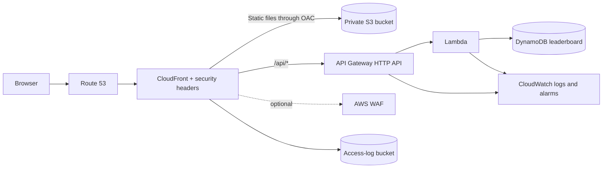

# 2048 on AWS

An accessible, installable 2048 game with a small serverless leaderboard. The live application is [play-2048.fozdigitalz.com](https://play-2048.fozdigitalz.com/).

## Architecture



There are no EC2 instances, containers, load balancers, or VPC components. Static files are private in S3 and readable only by CloudFront Origin Access Control. The browser uses the same hostname for `/api`, which avoids exposing a separate API URL in runtime configuration.

## Security and reliability

- Private, encrypted, versioned S3 content bucket with all public-access blocks enabled
- CloudFront TLS 1.2+, HTTP-to-HTTPS redirect, IPv4/IPv6 DNS, compression, CSP, HSTS, clickjacking and MIME-sniffing protections
- Optional AWS WAF managed rules and `/api` IP rate limiting (`enable_waf = true`)
- Exact-origin CORS, API Gateway throttling, strict input validation, idempotent score writes, and safe DOM rendering
- DynamoDB encryption, point-in-time recovery, and production deletion protection
- CloudFront access logs plus retained Lambda/API logs, X-Ray traces, and CloudWatch alarms
- GitHub Actions OIDC—no long-lived AWS access keys—and actions pinned to immutable commits
- Consent-first analytics, no advertising signals, a privacy notice, local game recovery, offline support, and accessible dialogs/controls

## Local development

Node.js 22 or newer is recommended.

```bash
npm ci
npm ci --omit=dev --prefix terraform/lambda
npm test
npm start
```

Open `http://localhost:8000`. Without a deployed API proxy, the game remains playable and the leaderboard displays a recoverable unavailable state.

## Deployment prerequisites

The workflow deploys from `cloudfront-hosting` and uses the existing role:

```text
arn:aws:iam::211125602758:role/github-platform-actions-oidc
```

Configure these GitHub settings before the first run:

- Environment: `production`; add a required reviewer if deployment approval is desired.
- Secret `ACM_CERTIFICATE_ARN`: an ACM certificate in `us-east-1` covering `play-2048.fozdigitalz.com`.
- Secret `HOSTED_ZONE_ID`: the Route 53 public hosted-zone ID.
- Optional variable `DOMAIN_NAME` (default `fozdigitalz.com`).
- Optional variable `SUBDOMAIN` (default `play-2048`).
- Optional variable `ENABLE_WAF` (default `false`; enabling WAF adds cost).

Because the jobs use the `production` environment, the OIDC role trust policy must allow the GitHub subject `repo:Fidelisesq/2048-Game:environment:production` and audience `sts.amazonaws.com`. The role also needs access to the Terraform state path and the AWS resources managed in `terraform/`.

The remote state bucket `foz-terraform-state-bucket` is external to this stack. Keep bucket versioning, encryption, public-access blocking, and least-privilege access enabled on it.

## Safe release process

1. Open a pull request. The workflow runs JavaScript tests, syntax checks, Terraform formatting, and `terraform validate` without AWS credentials.
2. Review the Terraform plan carefully, especially on the first migration from the public S3 website origin.
3. Merge to `cloudfront-hosting` and approve the `production` environment job if protection rules are configured.
4. The workflow applies the reviewed plan, uploads only release assets with explicit cache headers, and invalidates entry files.

Production destruction is intentionally absent from CI. DynamoDB deletion protection and non-empty versioned buckets require an explicit, reviewed teardown procedure.

More operational detail is in [documentation.md](documentation.md), and vulnerability reporting guidance is in [SECURITY.md](SECURITY.md).
